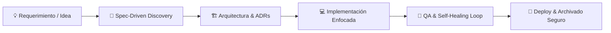

<div align="center">

# 🤖 ai-agents OS
### *Framework de Specification-Driven Development (SDD) para Ingeniería Asistida por IA*

[](CHANGELOG.md)
[](README.md)
[](docs/sdd-philosophy.md)
[](docs/workflow-memory.md)

**Transforma tu IDE en un equipo de ingeniería de software autónomo y coordinado.**  
*Documentos como fuente de verdad · Agentes especializados · Workflows con DAG · Memoria persistente · Grafo de decisiones · Dashboard visual*

---

</div>

## 📑 Tabla de Contenidos

1. [✨ ¿Qué es ai-agents OS?](#-qué-es-ai-agents-os)
2. [⚡ Quick Start (3 Minutos)](#-quick-start-3-minutos)
3. [🏛️ Arquitectura del Sistema](#️-arquitectura-del-sistema)
   - [👥 8 Agentes Especializados](#-8-agentes-especializados)
   - [🧩 15 Framework Skills](#-15-framework-skills)
   - [🔄 5 Workflows con DAG](#-5-workflows-con-dag)
   - [🧠 Memoria Persistente (4-Tier Memory)](#-memoria-persistente-4-tier-memory)
   - [🕸️ Knowledge Graph de Decisiones (ADR)](#️-knowledge-graph-de-decisiones-adr)
   - [📦 Sistema de Archivado Automático e Interactivo](#-sistema-de-archivado-automático-e-interactivo)
   - [📊 Visualizador Interactivo (Dashboard Web)](#-visualizador-interactivo-dashboard-web)
4. [🛠️ Suite de Automatización CLI](#️-suite-de-automatización-cli)
5. [📂 Estructura Documental y Convenciones](#-estructura-documental-y-convenciones)
6. [💡 Filosofía y Principios SDD](#-filosofía-y-principios-sdd)
7. [📚 Documentación del Repositorio](#-documentación-del-repositorio)

---

## ✨ ¿Qué es ai-agents OS?

`ai-agents` es un **sistema operativo de desarrollo asistido por IA** diseñado para elevar el desarrollo de software con modelos de lenguaje a un estándar de ingeniería riguroso y profesional.



* **No es un chatbot monolítico:** Convierte el IDE en un equipo coordinado con roles especializados (Analyst, UI Designer, Architect, Developer, QA, Tech Lead, DevOps, Skill Manager).
* **Documentos > Conversación:** El conocimiento vive en artefactos inmutables y trazables (`spec.md`, `architecture.md`, `qa.md`), no en chats efímeros.
* **Memoria Persistente entre Sesiones:** Nunca repite explicaciones ni pierde contexto gracias al sistema `Capture → Compact → Recall`.
* **Grafo de Decisiones Conectado:** Modela relaciones arquitectónicas (`depends_on`, `supersedes`, `conflicts_with`) para prevenir deuda técnica.

---

## ⚡ Quick Start (3 Minutos)

### 1️⃣ Agregar como Git Submodule en tu proyecto
```bash
git submodule add https://github.com/ezequielmendoza-dev/ai-agents.git .ai/agents
git commit -m "chore: add ai-agents OS submodule"
```

### 2️⃣ Inicializar entorno y reglas de IDE
```bash
bash .ai/agents/scripts/setup-ide.sh
```
*El script interactivo creará `.ai/`, generará los seeds de memoria/métricas/grafo y configurará tu IDE (Cursor, Claude Code, Windsurf, Roo-Code/Cline o Copilot).*

### 3️⃣ Crear y desarrollar tu primera iniciativa
```bash
# Crear estructura
bash .ai/agents/scripts/new-initiative.sh FEAT 001 login-mfa

# Abrir el Dashboard interactivo
bash .ai/agents/scripts/dashboard.sh
```

---

## 🏛️ Arquitectura del Sistema

### 👥 8 Agentes Especializados

Cada agente opera bajo un rol estricto, consumiendo los artefactos de la fase previa y generando contratos verificables:

| Rol | Archivo | Responsabilidad Principal | Artefacto de Salida |
| :--- | :--- | :--- | :--- |
| 🧙‍♂️ **Skill Manager** | [`roles/skill-manager.md`](roles/skill-manager.md) | Orquestador de contexto, catálogo de skills y memoria | `context-snapshot.md` |
| 📋 **Product Analyst** | [`roles/analyst.md`](roles/analyst.md) | Requerimientos, reglas de negocio y discovery | `spec.md`, `discovery.md` |
| 🎨 **UI Designer** | [`roles/ui-designer.md`](roles/ui-designer.md) | Tokens de diseño, maquetas UI, estados y a11y | `ui-design.md` |
| 🏗️ **Software Architect** | [`roles/architect.md`](roles/architect.md) | Diseño técnico, esquemas de BD y ADRs | `architecture.md`, `decision.md` |
| 💻 **Senior Developer** | [`roles/developer.md`](roles/developer.md) | Implementación de código y tests automatizados | Código + Test Suites |
| 🧪 **QA Engineer** | [`roles/qa.md`](roles/qa.md) | Validación técnica, regresión y Self-Healing loop | `qa.md` (`APROBADO`/`RECHAZADO`) |
| 🛡️ **Tech Lead** | [`roles/tech-lead.md`](roles/tech-lead.md) | Code review, supervisión, staging gate y hand-off | Veredicto Final & Merge |
| 🚀 **DevOps Engineer** | [`roles/devops.md`](roles/devops.md) | CI/CD, infraestructura, release y deployment | Pipelines, Despliegue |

---

### 🧩 15 Framework Skills

Metodologías de ingeniería listas para ser activadas dinámicamente por cualquier rol:

```
skills/
├── analysis/       ➔ requirements-discovery · ux-heuristics
├── architecture/   ➔ api-design · backend-architecture · database-design · performance-tuning · ai-integration
├── development/    ➔ code-review · frontend-patterns · mobile-development
├── qa/             ➔ test-strategy · testing-automation · security-audit
└── workflow/       ➔ release-readiness · devops-pipeline
```

> **Descubrimiento Externo:** El Skill Manager descubre dinámicamente skills instaladas por el usuario, servidores MCP y catálogos globales como [skills.sh](https://www.skills.sh/).

---

### 🔄 5 Workflows con DAG (Directed Acyclic Graph)

Flujos estructurados con dependencias formales, gates de calidad y bucles de autocorrección:

| Workflow | Propósito | Secuencia de Agentes |
| :--- | :--- | :--- |
| 🚀 [`new-feature.md`](workflows/new-feature.md) | Desarrollo end-to-end de nueva funcionalidad | `Analyst → UI → Architect → Tech Lead → Dev → QA → Tech Lead/DevOps` |
| 🐛 [`bug-fix.md`](workflows/bug-fix.md) | Diagnóstico y corrección por severidad | `Triage → Analyst/Architect/UI → Dev → QA (Self-Healing Loop)` |
| 🧹 [`refactor.md`](workflows/refactor.md) | Reestructuración de código sin alterar comportamiento | `Architect → Developer → QA (Regression Tests)` |
| 📦 [`release.md`](workflows/release.md) | Despliegue controlado a producción con rollback | `Tech Lead → DevOps → QA Post-Deploy` |
| 🏛️ [`architecture-change.md`](workflows/architecture-change.md) | Modificación estructural con ADR obligatorio | `Architect → Tech Lead → Knowledge Graph Sync` |

**Modos de Ejecución:**
* 🟢 **Rápido:** Trunca contexto para tareas menores y cambios cosméticos.
* 🟡 **Estándar (Default):** Flujo completo con validación rigurosa de artefactos.
* 🔴 **Profundo:** Revisión adversarial, auditoría de seguridad y múltiples pasadas de QA.

---

### 🧠 Memoria Persistente (4-Tier Memory)

Evita que los agentes olviden decisiones o re-expliquen conceptos entre sesiones:

```
.ai/memory/
├── workflow-log.md         ← Memoria Episódica: Log append-only cronológico de ejecuciones
├── decisions-catalog.md    ← Memoria Semántica: Índice de decisiones y ADRs vigentes
├── patterns-learned.md     ← Memoria Procedimental: Lecciones aprendidas y buenas prácticas
└── context-snapshot.md     ← Memoria Compactada: Resumen ejecutivo (~30 líneas) para inicio de sesión
```

---

### 🕸️ Knowledge Graph de Decisiones (ADR)

Indexa las decisiones arquitectónicas (`.ai/knowledge-graph.yaml`) como un grafo de relaciones tipadas:

```yaml
# .ai/knowledge-graph.yaml
nodes:
  - id: ARCH-115
    title: "Bloqueo de Acceso por Reserva Fuera de Horario"
    status: ACTIVE
    depends_on: [ARCH-103, ARCH-112]
    supersedes: []
    conflicts_with: []
```

* 🔵 **`depends_on`**: Relación de dependencia directa.
* 🟡 **`supersedes`**: Decisión que reemplaza y vuelve obsoleta a una anterior.
* 🔴 **`conflicts_with`**: Incompatibilidad condicionada.
* 🌐 **`related`**: Decisiones complementarias en el mismo dominio.

---

### 📦 Sistema de Archivado Automático e Interactivo (v3.4.0)

Garantiza la higiene del contexto y una mesa de trabajo limpia, moviendo iniciativas completadas desde `.ai/features/` a `.ai/archive/`:

* 🛡️ **Gate de Calidad Inquebrantable:** Verifica que `qa.md` tenga veredicto `APROBADO`.
* 🔗 **Reconciliación de Rutas en el Grafo:** Actualiza automáticamente `ref: features/...` $
ightarrow$ `ref: archive/...` en `knowledge-graph.yaml`.
* 📝 **Registro de Memoria:** Agrega el cierre a `workflow-log.md` y regenera `context-snapshot.md`.
* 🧪 **Protocolo Staging Interactivo:** El Tech Lead / QA consulta al usuario para validar en el entorno de pruebas antes de autorizar el archivado definitivo.

```bash
# Archivar una iniciativa individualmente
bash .ai/agents/scripts/archive-initiative.sh FEAT-113

# Cerrar fase y archivar en un solo comando
bash .ai/agents/scripts/finish-phase.sh FEAT-113 approval tech-lead --verdict APROBADO --archive

# Auto-archivar en lote todas las iniciativas aprobadas
bash .ai/agents/scripts/sync-initiatives.sh --archive-approved
```

---

### 📊 Visualizador Interactivo (Dashboard Web Autónomo)

Explora todo el ecosistema de tu proyecto en una aplicación web interactiva local de ancho completo:

```bash
bash .ai/agents/scripts/dashboard.sh
```

* 🏢 **Tab Proyecto:** Visor completo de identidad, objetivos de negocio, actores/roles, stack y ficha técnica.
* 📁 **Tab Iniciativas:** Matriz de features/bugs con buscador, filtros, telemetría y visualizador de artefactos SDD.
* 🕸️ **Tab Grafo ADR:** Visualización 2D interactiva (Vis.js) con física de nodos, herramientas de zoom, búsqueda y panel de detalle.
* 📜 **Tab Reglas:** Reglas de negocio e invariantes del sistema (`business-rules.md`).
* 🧠 **Tab Memoria:** Snapshot ejecutivo, log episódico, catálogo de decisiones y patrones aprendidos.
* 📈 **Tab Telemetría:** Métricas de consumo de tokens (in/out), costos estimados y gráficos (Chart.js) por rol y fase.
* ℹ️ **Modal About:** Documentación embebida del framework accesible desde el navbar.

---

## 🛠️ Suite de Automatización CLI

Todos los scripts residen en `.ai/agents/scripts/` y estandarizan el ciclo de vida del proyecto:

| Comando | Propósito | Ejemplo de Uso |
| :--- | :--- | :--- |
| **`setup-ide.sh`** | Inicializa `.ai/`, memoria, métricas, KG y reglas de IDE | `bash .ai/agents/scripts/setup-ide.sh` |
| **`update-ai-agents.sh`** | Actualiza el framework (submodule + auto-fix + validación) | `bash .ai/agents/scripts/update-ai-agents.sh` |
| **`new-initiative.sh`** | Bootstrap de nueva iniciativa (`FEAT`, `BUG`, `AUDIT`, `REF`) | `bash .ai/agents/scripts/new-initiative.sh FEAT 042 pagos-stripe` |
| **`finish-phase.sh`** | Cierre formal de fase (registra memory, metrics y snapshot) | `bash .ai/agents/scripts/finish-phase.sh FEAT-042 qa qa --verdict APROBADO` |
| **`archive-initiative.sh`** | Archiva una iniciativa a `.ai/archive/` con validación QA | `bash .ai/agents/scripts/archive-initiative.sh FEAT-042` |
| **`sync-initiatives.sh`** | Reconcilia, auto-repara (`--fix`) y auto-archiva (`--archive-approved`) | `bash .ai/agents/scripts/sync-initiatives.sh --fix --archive-approved` |
| **`validate-project.sh`** | Auditoría documental y chequeo de conformidad del framework | `bash .ai/agents/scripts/validate-project.sh` |
| **`dashboard.sh`** | Genera y abre el visualizador interactivo (`dashboard.html`) | `bash .ai/agents/scripts/dashboard.sh` |

---

## 📂 Estructura Documental y Convenciones

```
mi-proyecto/
├── .ai/
│   ├── agents/                  ← Submódulo Git (ai-agents framework)
│   ├── context.md               ← Identidad, stack, convenciones y registro de IDs
│   ├── business-rules.md        ← Reglas de negocio e invariantes permanentes
│   ├── architecture.md          ← Arquitectura actual del sistema en producción
│   ├── decisions.md             ← Registro cronológico de ADRs
│   ├── knowledge-graph.yaml     ← Grafo ligero de decisiones arquitectónicas
│   ├── glossary.md              ← Glosario y términos del dominio
│   ├── memory/                  ← Memoria persistente del pipeline
│   │   ├── workflow-log.md      ← Log episódico de sesiones
│   │   ├── decisions-catalog.md ← Catálogo semántico de decisiones
│   │   ├── patterns-learned.md  ← Lecciones y patrones aprendidos
│   │   └── context-snapshot.md  ← Snapshot compactado de contexto
│   ├── metrics/                 ← Métricas y telemetría de tokens
│   │   └── executions.yaml      ← Registro de ejecuciones
│   ├── features/                ← Iniciativas activas en desarrollo (FEAT-XXX, BUG-XXX)
│   ├── archive/                 ← Iniciativas cerradas y en producción (Read-Only)
│   └── dashboard.html           ← Dashboard visual interactivo generado
├── AGENTS.md                    ← Fuente de verdad para agentes en el proyecto
└── .cursorrules / CLAUDE.md     ← Reglas de configuración según tu IDE
```

### 📋 Las 5 Reglas Documentales (R1-R5)

1. **R1:** Antes de crear un documento, verificar si existe uno equivalente para actualizar.
2. **R2:** Priorizar la **actualización** sobre la creación.
3. **R3:** Nunca crear versiones paralelas (`spec-v2.md`). Modificar el documento canónico.
4. **R4:** Los cambios estructurales deben reflejarse en `CHANGELOG.md` y documentos globales.
5. **R5:** Los documentos representan el **estado actual**, no el histórico.

---

## 💡 Filosofía y Principios SDD

* **Artefactos como Fuente de Verdad:** Las decisiones se escriben en documentos formales, no en el historial de chat.
* **Discovery antes de Spec:** Se investiga el problema antes de redactar especificaciones.
* **Localization Step:** El Developer delimita con exactitud los archivos a intervenir antes de escribir código.
* **Economía de Contexto:** Cada agente recibe únicamente los documentos pertinentes a su rol.

---

## 📚 Documentación del Repositorio

| Guía | Propósito |
| :--- | :--- |
| 📖 [`docs/sdd-philosophy.md`](docs/sdd-philosophy.md) | Modelo mental de Specification-Driven Development |
| 🧠 [`docs/workflow-memory.md`](docs/workflow-memory.md) | Sistema de Memoria Persistente en 4 capas |
| 🔄 [`docs/workflow-dag.md`](docs/workflow-dag.md) | Definición y modos de ejecución de workflows con DAG |
| 🕸️ [`docs/knowledge-graph.md`](docs/knowledge-graph.md) | Modelado del Grafo de Decisiones Arquitectónicas |
| 📊 [`docs/agent-metrics.md`](docs/agent-metrics.md) | Telemetría de tokens, duración y costos por fase |
| 🧩 [`docs/skill-discovery.md`](docs/skill-discovery.md) | Descubrimiento, resolución y aislamiento de skills |
| 🔌 [`docs/project-integration.md`](docs/project-integration.md) | Guía de instalación, migración y submódulos Git |
| 📝 [`roles/prompt-guide.md`](roles/prompt-guide.md) | Guía de prompts efectivos por rol |

---

<div align="center">

**ai-agents OS** · *Desarrollado para pensar en grande, empezar en pequeño y escalar con orden y disciplina.*  
Distribuido bajo licencia MIT.

</div>
