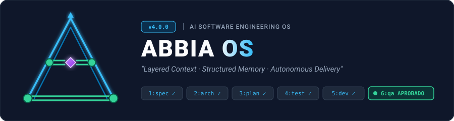
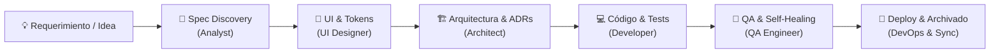

<div align="center">



<br/><br/>

### *De la improvisación en el chat a la precisión de un estudio de ingeniería.*
**Framework de Specification-Driven Development (SDD) & Orquestación Multi-Agente Asistida por IA**

[](CHANGELOG.md)
[](README.md)
[](docs/sdd-philosophy.md)
[](docs/workflow-memory.md)
[](LICENSE)

<br/>

**Transforma tu IDE en un estudio de ingeniería de software autónomo, estructurado y auditable.**  
*Layered Context · Structured Memory · Autonomous Delivery · Artefactos como verdad · Workflows con DAG · TUI & Visualizador web*

---

</div>

## 💡 ¿Por qué Abbia OS?

Desarrollar software complejo con IA hoy suele sentirse como una sesión caótica de improvisación:
* 😵 **Context Drift & Amnesia:** El chat olvida decisiones tomadas 10 mensajes atrás.
* 🌪️ **El Chatbot "Sabelotodo":** Un único prompt gigante intenta ser analista, arquitecto, frontend, backend y QA al mismo tiempo, fallando en los detalles críticos.
* 💣 **Refactors a Ciegas:** La IA reescribe código rompiendo contratos previos e invariantes de negocio no documentadas.

### 🎙️ La Filosofía del Estudio de Grabación

En los legendarios estudios de grabación (como *Abbey Road*, de donde nace nuestro nombre y donde bandas icónicas como *Pink Floyd* y *The Beatles* crearon sus obras maestras), **nada queda al azar**:
1. Cada instrumento se graba en su propia **pista aislada** con micrófonos dedicados (*Agentes con roles y contextos acotados*).
2. La cinta matriz y las notas de sesión registran cada toma (*Memoria persistente en 3 capas*).
3. La mezcla y la masterización validan que cada frecuencia esté en su lugar antes de ir al vinilo (*QA adversarial y Quality Gates*).

**Abbia OS** traslada esta disciplina al desarrollo de software con IA: sustituimos los hilos de chat efímeros por **artefactos versionados en Git**, **contratos de contexto claros** y **flujos DAG deterministas**.

---

## ⚡ Quick Start (En 3 Minutos)

### 1️⃣ Agrega Abbia OS como Git Submodule
En la raíz del repositorio de tu aplicación:
```bash
git submodule add https://github.com/ezequielmendoza-dev/abbia-os.git .abbia/core
git commit -m "chore: integrate Abbia OS core submodule"
```

### 2️⃣ Inicializa el entorno e integra tu IDE
```bash
bash .abbia/core/scripts/setup-ide.sh
```
> 🪄 *El script creará automáticamente el directorio `.abbia/`, sembrará la memoria persistente, instalará el ejecutable `./abbia` y configurará las reglas de tu IDE favorito (**Cursor, Claude Code, Windsurf, Cline o GitHub Copilot**).*

### 3️⃣ Crea tu primera iniciativa
```bash
# Crear estructura de una nueva feature
./abbia new FEAT 001 autenticacion-mfa

# Abrir el Dashboard interactivo con telemetría y grafo en tiempo real
./abbia dashboard
```

---

## 🏛️ ¿Cómo Funciona Abbia OS?



### 👥 8 Agentes Especializados (Tus pistas de producción)

Cada agente cuenta con un rol definido, herramientas específicas y un **Context Contract** que garantiza que solo consuma la información que necesita, maximizando la precisión del modelo y minimizando el gasto de tokens.

| Rol | Definición | Responsabilidad Principal | Artefacto de Salida |
| :--- | :--- | :--- | :--- |
| 🧙‍♂️ **Skill Manager** | [`roles/skill-manager.md`](roles/skill-manager.md) | Capability Advisor, resolución de skills y memoria técnica | `context-snapshot.md` |
| 📋 **Product Analyst** | [`roles/analyst.md`](roles/analyst.md) | Discovery, especificación funcional y casos de borde | `spec.md`, `discovery.md` |
| 🎨 **UI Designer** | [`roles/ui-designer.md`](roles/ui-designer.md) | Tokens de diseño, maquetas UI, estados y a11y | `ui-design.md` |
| 🏗️ **Software Architect** | [`roles/architect.md`](roles/architect.md) | Diseño técnico, esquemas de BD y ADRs vinculados | `architecture.md`, `decision.md` |
| 💻 **Senior Developer** | [`roles/developer.md`](roles/developer.md) | Implementación de código y tests automatizados | Código + Test Suites |
| 🧪 **QA Engineer** | [`roles/qa.md`](roles/qa.md) | Validación adversarial, tests E2E y Self-Healing loop | `qa.md` (`APROBADO`/`RECHAZADO`) |
| 🛡️ **Tech Lead** | [`roles/tech-lead.md`](roles/tech-lead.md) | Code review, supervisión, staging gate y hand-off | Veredicto Final & Merge |
| 🚀 **DevOps Engineer** | [`roles/devops.md`](roles/devops.md) | CI/CD, infraestructura, release y deployment | Pipelines, Despliegue |

---

### 🧩 15 Framework Skills (Metodologías Plug & Play)

Metodologías de ingeniería listas para ser activadas dinámicamente según la tarea:

```
skills/
├── analysis/       ➔ requirements-discovery · ux-heuristics
├── architecture/   ➔ api-design · backend-architecture · database-design · performance-tuning · ai-integration
├── development/    ➔ code-review · frontend-patterns · mobile-development
├── qa/             ➔ test-strategy · testing-automation · security-audit
└── workflow/       ➔ release-readiness · devops-pipeline
```

---

### 🧠 Abbia 3-Tier Memory (Memoria Persistente)

La memoria del proyecto no se pierde entre chats o reinicios de IDE:

1. **Tier 1 — Memoria Episódica (`.abbia/memory/workflow-log.md`):** Registro cronológico e inmutable de cada fase completada, qué agente intervino y qué archivos cambió.
2. **Tier 2 — Memoria Compactada (`.abbia/memory/context-snapshot.md`):** Resumen ejecutivo regenerado automáticamente con el estado actual, iniciativas activas y bloqueos.
3. **Tier 3 — Memoria Semántica (`.abbia/knowledge-graph.yaml`):** Grafo de Decisiones de Arquitectura (ADRs) con dependencias, conflictos y reemplazos.

---

### 🛠️ Suite de Comandos CLI (`./abbia`)

Abbia OS incluye un CLI wrapper listo para usar en tu terminal:

```bash
# Iniciar una iniciativa (feature, bug, audit, refactor)
./abbia new FEAT 042 checkout-stripe

# Finalizar fase y registrar telemetría (tokens, duración, snapshot)
./abbia finish FEAT-042 spec analyst --model gpt-4o --tokens-in 1200 --tokens-out 800

# Archivar iniciativa completada a .abbia/archive/ tras QA aprobado
./abbia archive FEAT-042

# Sincronizar y auto-reparar métricas y grafo
./abbia sync --fix

# Validar conformidad documental del proyecto
./abbia validate

# Lanzar el visualizador web interactivo (abre .abbia/dashboard.html)
./abbia dashboard

# Iniciar servidor local en vivo con Live Reload (auto-recarga en tiempo real)
./abbia serve [PORT]

# Vigilar cambios en .abbia/ y auto-regenerar dashboard.html en segundo plano
./abbia watch

# Actualizar el framework a la última versión
./abbia update

# Migrar proyecto existente desde .ai/ o .stratum/
./abbia migrate
```

---

### 📊 Dashboard Interactivo & Live Visualizer

Con `./abbia dashboard` o `./abbia serve`, accede a una aplicación visual completa para auditar y monitorear tu proyecto:
* ⚡ **Live Reload & Auto-Regeneración:** Los scripts de ciclo de vida (`finish`, `new`, `archive`, `sync`) actualizan automáticamente `dashboard.html`. Con `./abbia serve`, el navegador se **recarga solo en tiempo real** al guardar cualquier archivo.
* 📈 **Telemetría & FinOps:** Gráficos 2x2 de consumo de tokens, costos en USD estimados en vivo (OpenRouter API) y duración por fase/modelo.
* 🕸️ **Grafo 2D Interactivo:** Visualización física de decisiones de arquitectura y sus dependencias (Vis.js).
* 📋 **Matriz de Iniciativas:** Estado en vivo de especificaciones, diseños y veredictos de QA.
* 📜 **Reglas de Negocio & Memoria:** Consulta centralizada de invariantes del sistema, lecciones y bitácora de sesiones.

---

### 📂 Anatomía de un Proyecto con Abbia OS

```
mi-proyecto/
├── .abbia/
│   ├── core/                    ← Submódulo Git (Abbia OS Framework)
│   ├── context.md               ← Identidad, stack tecnológico y registro de IDs
│   ├── business-rules.md        ← Reglas de negocio e invariantes permanentes
│   ├── architecture.md          ← Arquitectura viva del sistema
│   ├── decisions.md             ← Registro cronológico de ADRs
│   ├── knowledge-graph.yaml     ← Grafo de decisiones arquitectónicas
│   ├── glossary.md              ← Glosario y términos del dominio
│   ├── memory/                  ← Memoria en 3 Capas
│   │   ├── workflow-log.md      ← Log episódico de sesiones
│   │   ├── patterns-learned.md  ← Lecciones y patrones aprendidos
│   │   └── context-snapshot.md  ← Snapshot compactado de contexto
│   ├── metrics/                 ← Telemetría y observabilidad
│   │   └── executions.yaml      ← Registro de ejecuciones y costos
│   ├── initiatives/             ← Iniciativas activas (FEAT-XXX, BUG-XXX)
│   ├── archive/                 ← Iniciativas finalizadas en producción
│   └── dashboard.html           ← Dashboard visual interactivo
├── abbia                        ← CLI wrapper ejecutable
├── AGENTS.md                    ← Fuente de verdad para agentes en el proyecto
└── .cursorrules / CLAUDE.md     ← Reglas según tu IDE preferido
```

---

## 🏆 Proyecto de Referencia Canónico (Golden Project)

Explora [`examples/golden-project/`](examples/golden-project/) para ver un proyecto real configurado con Abbia OS:
* Incluye iniciativas en curso (`.abbia/initiatives/FEAT-002-order-checkout/`).
* Incluye iniciativas cerradas en producción (`.abbia/archive/FEAT-001-user-auth/`).
* Grafo de arquitectura interconectado y telemetría de muestra.

---

## 🔄 ¿Vienes de `.ai/` o versiones previas?

¡Migrar es facilísimo y 100% seguro! Si tu proyecto tiene la estructura previa (`.ai/` o `.stratum/`), actualiza tu submódulo y ejecuta el script de migración:

```bash
# 1. Actualiza el submódulo a la última versión de Abbia OS
git submodule update --remote

# 2. Ejecuta el script de migración desde tu estructura previa
bash .ai/agents/scripts/migrate-to-abbia.sh
# (o si venías de .stratum/: bash .stratum/core/scripts/migrate-to-abbia.sh)
```

> 💡 *El script migrará tus artefactos a `.abbia/`, preservará todas tus iniciativas y memoria técnica, configurará `.gitmodules` y dejará instalado el nuevo CLI wrapper `./abbia` en la raíz de tu proyecto.*  
> Para más detalles paso a paso, consulta la [Guía de Migración a Abbia OS v4.0.0](docs/migration-guide-v4.md).

---

## 📚 Documentación Técnica Detallada

| Guía | Tema |
| :--- | :--- |
| 📖 [`docs/migration-guide-v4.md`](docs/migration-guide-v4.md) | Guía paso a paso para migrar a Abbia OS v4.0.0 |
| 📖 [`docs/sdd-philosophy.md`](docs/sdd-philosophy.md) | Modelo mental de Specification-Driven Development |
| 🧠 [`docs/workflow-memory.md`](docs/workflow-memory.md) | Arquitectura de la Memoria Persistente en 3 capas |
| 🔄 [`docs/workflow-dag.md`](docs/workflow-dag.md) | Definición y modos de ejecución de workflows con DAG |
| 🕸️ [`docs/knowledge-graph.md`](docs/knowledge-graph.md) | Modelado del Grafo de Decisiones Arquitectónicas |
| 📊 [`docs/agent-metrics.md`](docs/agent-metrics.md) | Telemetría de tokens, duración y observabilidad FinOps |
| 🧩 [`docs/skill-discovery.md`](docs/skill-discovery.md) | Descubrimiento, resolución y aislamiento de skills |
| 🔌 [`docs/project-integration.md`](docs/project-integration.md) | Integración con submódulos Git en proyectos destino |
| 📝 [`roles/prompt-guide.md`](roles/prompt-guide.md) | Guía de prompts efectivos por rol |

---

<div align="center">

**Abbia OS** · *Layered Context, Structured Memory, Autonomous Delivery.*  
Construido con pasión para llevar el desarrollo con IA al siguiente nivel de calidad.  
Distribuido bajo licencia [MIT](LICENSE).

</div>
