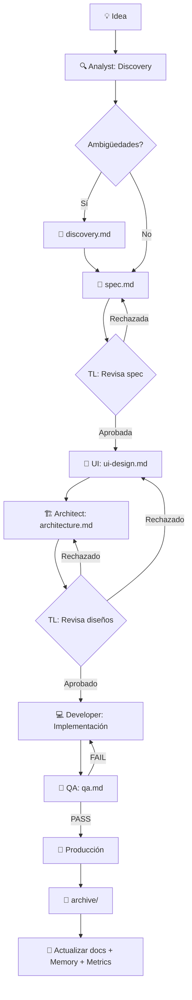

# 🤖 ai-agents — Framework de Specification-Driven Development

> **Ciclo de vida completo desde una idea hasta producción.**
> Documentos como fuente de verdad. Agentes como transformadores de conocimiento. Pipeline con memoria.

---

## Qué es esto

`ai-agents` es un **framework de desarrollo asistido por IA** que convierte tu IDE en un equipo de especialistas coordinados. No es una herramienta más de código — es un **sistema operativo de desarrollo** que pone orden en cómo la IA trabaja: roles con responsabilidades claras, workflows con dependencias explícitas, memoria que sobrevive entre sesiones, y un grafo de decisiones que modela el impacto de cada cambio.

**Lo que no es:** no es un agente monolítico, no es un chatbot, no reemplaza tu stack tecnológico. Es la capa de proceso que hace que la IA trabaje como un equipo de ingeniería profesional.

---

## Quick Start — 3 pasos

```bash
# 1. Agregar como submódulo en tu proyecto
git submodule add https://github.com/ezequielmendoza-dev/ai-agents.git .ai/agents

# 2. Ejecutar el instalador (crea .ai/, configura IDE, genera context)
bash .ai/agents/scripts/setup-ide.sh

# 3. Abrir tu IDE y empezar a trabajar — la IA ya tiene contexto del proyecto
```

El instalador te guía para:
- Crear la estructura `.ai/` con los documentos permanentes del proyecto
- Configurar las reglas de tu IDE (Cursor, Claude Code, Windsurf, Cline, Copilot)
- Generar `AGENTS.md` como fuente de verdad para los agentes

---

## Qué tiene el framework

### 👥 8 Agentes Especializados

Cada agente es un **rol profesional** con responsabilidad, constraints y output definidos:

| Agente | Qué hace | Output principal |
|--------|----------|------------------|
| **Skill Manager** | Orquesta skills, memoria y DAG antes de cada sesión | `context-snapshot.md` |
| **Product Analyst** | Transforma ideas en especificaciones claras | `spec.md`, `discovery.md` |
| **UI Designer** | Diseña interfaces con responsividad y a11y | `ui-design.md` |
| **Software Architect** | Diseña soluciones técnicas con ADRs | `architecture.md` |
| **Tech Lead** | Supervisa, revisa y toma decisiones (gate final) | Veredictos: APROBADO/RECHAZADO |
| **Senior Developer** | Implementa siguiendo la arquitectura aprobada | Código + `decision.md` |
| **QA Engineer** | Valida calidad con criterios objetivos | `qa.md` (PASS/FAIL) |
| **DevOps Engineer** | CI/CD, deployments, infraestructura | Configs, pipelines |

> Los agentes **solo consumen documentos**, no contexto conversacional. Esto hace el proceso reproducible: puede retomarse en cualquier sesión sin perder nada.

---

### 🧩 15 Framework Skills

Skills metodológicas reutilizables que encapsulan conocimiento especializado — cualquier agente las activa según la tarea:

| Categoría | Skills |
|-----------|--------|
| **Analysis** | `requirements-discovery` · `ux-heuristics` |
| **Architecture** | `api-design` · `backend-architecture` · `database-design` · `performance-tuning` · `ai-integration` |
| **Development** | `code-review` · `frontend-patterns` · `mobile-development` |
| **QA** | `test-strategy` · `testing-automation` · `security-audit` |
| **Workflow** | `release-readiness` · `devops-pipeline` |

Además, el Skill Manager **descubre skills externas** desde tu proyecto (`type: tech`), tu entorno de usuario (MCP Servers, Claude Code) y el catálogo [skills.sh](https://www.skills.sh/).

Ver [`skills/README.md`](skills/README.md) para el catálogo completo.

---

### 🔄 5 Workflows con DAG

Cada workflow declara su **grafo de dependencias explícito** (nodos, aristas, gates, back-edges) con 3 modos de ejecución:

| Workflow | Propósito | Agentes involucrados |
|----------|-----------|----------------------|
| [`new-feature.md`](workflows/new-feature.md) | Feature completa (idea → producción) | Analyst → UI → Architect → TL → Dev → QA |
| [`bug-fix.md`](workflows/bug-fix.md) | Corrección dinámica por severidad | Analyst → QA → Dev (según tipo de bug) |
| [`refactor.md`](workflows/refactor.md) | Refactorización sin cambio de comportamiento | Architect → Dev → QA |
| [`release.md`](workflows/release.md) | Deployment a producción con plan de rollback | TL → DevOps → QA |
| [`architecture-change.md`](workflows/architecture-change.md) | Cambios estructurales con ADR obligatorio | Architect → TL |

**Modos de ejecución:**
- **Rápido:** Para cambios menores — aggressively truncates context, skip optional stages.
- **Estándar:** El default — consumos normales, validaciones completas.
- **Profundo:** Para features críticas — revisión adversarial, más iteraciones de QA, más validación.

Ver [`docs/workflow-dag.md`](docs/workflow-dag.md) para la documentación completa del sistema DAG.

---

### 🧠 Workflow Memory — Memoria Persistente del Pipeline

**Problema que resuelve:** Sin memoria, cada sesión arranca de cero. Las decisiones se re-explican, los patrones se re-descubren, los errores se repiten.

**Solución:** `Capture → Compact → Recall`. Cada agente, al terminar, escribe una entrada en la memoria. Al iniciar la siguiente sesión, el Skill Manager compacta todo en un snapshot de ~30 líneas.

```
.ai/memory/
├── workflow-log.md         ← Memoria episódica (append-only)
├── decisions-catalog.md    ← Memoria semántica (decisiones indexadas)
├── patterns-learned.md     ← Memoria procedimental (lecciones aplicables)
└── context-snapshot.md     ← Memoria compactada (resumen para sesión)
```

| Tipo | Qué recuerda | Ejemplo |
|:---|:---|:---|
| **Episódica** | Qué pasó en cada sesión | "Architect eligió PostgreSQL vs SQLite por ACID" |
| **Semántica** | Decisiones vigentes | "Decisión DEC-013: PostgreSQL como motor único" |
| **Procedimental** | Lecciones reutilizables | "Tests E2E flaky por dependencia de orden → aislamiento por test" |

Ver [`docs/workflow-memory.md`](docs/workflow-memory.md).

---

### 🔗 Knowledge Graph — Grafo de Decisiones

**Problema que resuelve:** `decisions.md` es lineal — para entender el impacto de cambiar `ARCH-012`, hay que leer todo el log.

**Solución:** Un grafo ligero de nodos (ADRs) y aristas tipadas que permite calcular transitivamente qué decisiones dependen, superseden o están en conflicto.

```yaml
# .ai/knowledge-graph.yaml
nodes:
  - id: ARCH-012
    title: "PostgreSQL como motor único"
    status: ACTIVE
    depends_on: [ARCH-001]
    conflicts_with: [ARCH-015]
```

| Relación | Qué modela |
|----------|-----------|
| `depends_on` | Esta decisión asume que otra está vigente |
| `supersedes` | Esta decisión reemplaza a otra |
| `related` | Compatibles, sin dependencia |
| `conflicts_with` | Incompatibles bajo ciertas condiciones |

> Inspirado en Ogcode: grafo determinista y ligero, sin embeddings. Se escribe a mano por el Architect/Tech Lead.

Ver [`docs/knowledge-graph.md`](docs/knowledge-graph.md) + [`templates/knowledge-graph.yaml`](templates/knowledge-graph.yaml).

---

### 📊 Métricas de Agentes

**Problema que resuelve:** No se mide cuántos tokens consume cada fase, cuánto tiempo tarda, ni si los back-edges están quemando recursos.

**Solución:** Registro append-only por ejecución + agregados regenerados por el Skill Manager.

```yaml
# .ai/metrics/executions.yaml
executions:
  - ts: 2026-09-11T15:30:00Z
    initiative: FEAT-042
    role: architect
    phase: architecture
    tokens_in: 18423
    tokens_out: 5912
    duration_s: 812
    attempts: 1
    verdict: APROBADO
```

**Métricas derivadas (calculadas por Skill Manager):**
- **Costo por fase:** tokens totales agrupados por fase del pipeline.
- **Retry rate:** proxy de calidad del gate anterior.
- **Eficiencia de tokens:** qué fracción de lo consumido es producción útil.

Ver [`docs/agent-metrics.md`](docs/agent-metrics.md) + [`templates/metrics-executions.yaml`](templates/metrics-executions.yaml).

---

### 📂 Sistema Documental con 5 Reglas

El framework estructura el conocimiento del proyecto en dos niveles:

**Conocimiento permanente** (`.ai/`):
```
.ai/context.md          ← Identidad del proyecto
.ai/business-rules.md   ← Reglas de negocio del dominio
.ai/architecture.md     ← Arquitectura actual en producción
.ai/decisions.md        ← Log histórico de ADRs
.ai/glossary.md         ← Términos del dominio
.ai/memory/             ← Memoria del pipeline (NUEVO)
.ai/metrics/            ← Métricas del pipeline (NUEVO)
.ai/knowledge-graph.yaml← Grafo de decisiones (NUEVO)
```

**Trabajo por feature** (`.ai/features/FEAT-NNN-slug/`):
```
spec.md, ui-design.md, architecture.md, qa.md, decision.md
```

**Las 5 Reglas Documentales:**

| Regla | Resumen |
|-------|---------|
| **R1** | Antes de crear, verificar si existe uno equivalente |
| **R2** | Priorizar actualización sobre creación |
| **R3** | Nunca crear versiones paralelas — actualizar el existente |
| **R4** | Los cambios en roles/workflows se reflejan en CHANGELOG |
| **R5** | Los documentos representan el estado actual, no el histórico |

---

### ✅ Checklists por Área Técnica

| Checklist | Cubre |
|-----------|-------|
| [`frontend-review.md`](checklists/frontend-review.md) | HTML semántico, responsividad, performance |
| [`ui-review.md`](checklists/ui-review.md) | Consistencia visual, a11y, interacción |
| [`backend-review.md`](checklists/backend-review.md) | API, manejo de errores, seguridad |
| [`database-review.md`](checklists/database-review.md) | Esquemas, queries, migraciones |
| [`security-review.md`](checklists/security-review.md) | AuthN/Z, secretos, dependencias |
| [`performance-review.md`](checklists/performance-review.md) | Tiempos de respuesta, memory leaks |
| [`release-review.md`](checklists/release-review.md) | Checklist operacional pre-despliegue |

---

### ⚡ CI/CD Multi-Lenguaje

El template de GitHub Actions valida **dos cosas automáticamente**:

1. **Estructura documental** — que `.ai/` tenga los archivos obligatorios y que los bloques DAG estén balanceados.
2. **Tests por lenguaje** — detecta automáticamente `package.json` (Node), `pyproject.toml`/`requirements.txt` (Python), `go.mod` (Go) y corre los tests correspondientes.

Copia a tu proyecto:
```bash
cp .ai/agents/templates/github-action-ci.yml .github/workflows/ai-agents-validation.yml
```

---

### 🛠️ Scripts de Automatización

| Script | Qué hace | Uso |
|--------|----------|-----|
| [`setup-ide.sh`](scripts/setup-ide.sh) | Inicializa `.ai/`, genera seeds de memoria/métricas/KG, configura IDEs | `bash .ai/agents/scripts/setup-ide.sh` |
| [`update-ai-agents.sh`](scripts/update-ai-agents.sh) | Actualiza el framework (submodule + setup en un comando) | `bash .ai/agents/scripts/update-ai-agents.sh [vX.Y.Z]` |
| [`new-initiative.sh`](scripts/new-initiative.sh) | Crea estructura de feature/bug/auditoría/refactor automáticamente | `bash .ai/agents/scripts/new-initiative.sh FEAT 003 login-seguro` |
| [`finish-phase.sh`](scripts/finish-phase.sh) | Cierra una fase registrando memory, metrics y snapshot (append-only) | `bash .ai/agents/scripts/finish-phase.sh FEAT-114 qa` |
| [`sync-initiatives.sh`](scripts/sync-initiatives.sh) | Sincroniza y reconcilia iniciativas pendientes con memory, metrics y KG | `bash .ai/agents/scripts/sync-initiatives.sh` |
| [`validate-project.sh`](scripts/validate-project.sh) | Valida estructura documental + sistemas v3.2.0 (WARNs) | `bash .ai/agents/scripts/validate-project.sh` |

---

## Flujo de Trabajo Completo



**Cada paso produce un artefacto → el siguiente agente lo consume.** El pipeline es una cadena de documentos, no de prompts.

---

## Ejemplos de Uso

> **Nota:** Gracias a las reglas del IDE, la IA lee `.ai/context.md` automáticamente al ser invocada. No necesitas pegar contexto en cada prompt.

### Crear una feature

```markdown
# 1. Crear la estructura
bash .ai/agents/scripts/new-initiative.sh FEAT 003 login-seguro

# 2. Activar Analyst
Actúa como el agente Product Analyst definido en .ai/agents/roles/analyst.md.
Nuestra feature actual es: FEAT-003-login-seguro
Requerimiento: Login con autenticación MFA y rate limiting

# 3. Cuando la spec esté aprobada, activar UI Designer
Actúa como el agente UI Designer definido en .ai/agents/roles/ui-designer.md.
Nuestra feature actual es: FEAT-003-login-seguro
Genera ui-design.md basándote en spec.md aprobada.

# 4. Cuando la UI esté aprobada, activar Architect
Actúa como el agente Software Architect definido en .ai/agents/roles/architect.md.
Nuestra feature actual es: FEAT-003-login-seguro
Genera architecture.md basándote en spec.md + ui-design.md.
```

### Reportar un bug

```markdown
Actúa como el agente QA Engineer definido en .ai/agents/roles/qa.md.
Nuestra feature actual es: BUG-001-double-booking
Escribe el reporte en .ai/features/BUG-001-double-booking/bug-report.md
```

### Activar un agente con el Prompt Guide

```markdown
Lee .ai/agents/roles/prompt-guide.md y luego ejecuta el agente QA Engineer
para validar la feature FEAT-003-login-seguro.
```

Ver [`roles/prompt-guide.md`](roles/prompt-guide.md) para prompts de activación específicos por agente.

---

## Guía de Integración en tu Proyecto

### Paso 1: Agregar como Git Submodule

```bash
git submodule add https://github.com/ezequielmendoza-dev/ai-agents.git .ai/agents
git commit -m "chore: add ai-agents as submodule"
```

> ¿Ya clonaste un proyecto con esto? Ejecutá: `git submodule update --init --recursive`

### Paso 2: Ejecutar el Instalador

```bash
bash .ai/agents/scripts/setup-ide.sh
```

El script te guía para:
1. **Crear `.ai/`** con archivos permanentes del proyecto (`context.md`, `business-rules.md`, etc.)
2. **Configurar tu IDE** — Cursor, Claude Code, Windsurf, Cline o Copilot
3. **Actualizar `.gitignore`** para excluir sesiones locales

### Paso 3: Completar el contexto del proyecto

Edita `.ai/context.md` con la información de tu proyecto (stack, módulos, convenciones). O usa este prompt para autogenerarlo:

```markdown
Actúa como el agente Product Analyst definido en .ai/agents/roles/analyst.md
y genera .ai/context.md basándote en la plantilla .ai/agents/templates/project-context.md
tras escanear la estructura del proyecto.
```

### Paso 4: Empezar a trabajar

Tu IDE ahora puede:
- **Leer la memoria del proyecto** — `.ai/context.md`, `.ai/architecture.md`, `.ai/business-rules.md`
- **Asumir roles especializados** — los archivos de `.ai/agents/roles/`
- **Seguir workflows** — `new-feature`, `bug-fix`, `refactor`, `release`, `architecture-change`
- **Usar skills** — el Skill Manager detecta automáticamente las relevantes
- **Recordar entre sesiones** — Workflow Memory mantiene el contexto vivo

### Estructura resultante

```
mi-proyecto/
├── src/
├── .ai/
│   ├── agents/                  ← Submódulo (este repo)
│   ├── context.md
│   ├── business-rules.md
│   ├── architecture.md
│   ├── decisions.md
│   ├── knowledge-graph.yaml     ← Grafo de decisiones
│   ├── glossary.md
│   ├── memory/                  ← Memoria del pipeline
│   │   ├── workflow-log.md
│   │   ├── decisions-catalog.md
│   │   ├── patterns-learned.md
│   │   └── context-snapshot.md
│   ├── metrics/                 ← Métricas del pipeline
│   │   └── executions.yaml
│   ├── features/
│   │   └── FEAT-001-nombre/
│   │       ├── spec.md
│   │       ├── ui-design.md
│   │       ├── architecture.md
│   │       ├── qa.md
│   │       └── decision.md
│   ├── archive/
│   └── sessions/
├── .github/workflows/
│   └── ai-agents-validation.yml ← CI multi-lenguaje
├── AGENTS.md                    ← Fuente de verdad para agentes
├── .cursorrules / CLAUDE.md     ← Reglas de tu IDE
└── .gitignore
```

---

## Actualizar el Framework

```bash
# Actualizar al último commit
git submodule update --remote .ai/agents && git add .ai/agents && git commit -m "chore: update ai-agents"

# Pinear a una versión específica
cd .ai/agents && git checkout v3.2.0 && cd ../..
git add .ai/agents && git commit -m "chore: pin ai-agents to v3.2.0"
```

---

## Filosofía de Trabajo

| Principio | Descripción |
|-----------|-------------|
| **Documentos > Conversación** | El conocimiento vive en artefactos verificables |
| **Artefactos como fuente de verdad** | Cada agente consume el documento del anterior |
| **Discovery antes de Spec** | Se explora antes de especificar |
| **Actualización > Creación** | Si el documento existe, actualizarlo es la respuesta |
| **Sin Duplicación** | Los proyectos referencian, no copian |
| **Roles Claros** | Cada agente tiene responsabilidades definidas |

Ver [`docs/sdd-philosophy.md`](docs/sdd-philosophy.md) para el modelo mental completo.

---

## Documentación Completa

### Sistemas del Framework
| Documento | Qué cubre |
|-----------|-----------|
| [`docs/workflow-memory.md`](docs/workflow-memory.md) | Memoria persistente: Capture → Compact → Recall |
| [`docs/workflow-dag.md`](docs/workflow-dag.md) | DAG de workflows: nodos, aristas, gates, modos de ejecución |
| [`docs/knowledge-graph.md`](docs/knowledge-graph.md) | Grafo ligero de decisiones arquitectónicas |
| [`docs/agent-metrics.md`](docs/agent-metrics.md) | Métricas por rol y fase: tokens, tiempo, retry rate |

### Gestión de Skills
| Documento | Qué cubre |
|-----------|-----------|
| [`docs/skill-discovery.md`](docs/skill-discovery.md) | Cómo se descubren las skills disponibles |
| [`docs/skill-resolution.md`](docs/skill-resolution.md) | Resolución de alias, dependencias y conflictos |
| [`docs/external-skill-providers.md`](docs/external-skill-providers.md) | Integración con skills.sh, MCP Servers |
| [`docs/skill-context.md`](docs/skill-context.md) | Cómo el contexto enriquece el comportamiento |
| [`skills/README.md`](skills/README.md) | Catálogo de las 15 framework skills |
| [`skills/registry.md`](skills/registry.md) | Reglas dinámicas de priorización |

### Convenciones y Estructura
| Documento | Qué cubre |
|-----------|-----------|
| [`docs/sdd-philosophy.md`](docs/sdd-philosophy.md) | Filosofía Specification-Driven Development |
| [`docs/artifact-lifecycle.md`](docs/artifact-lifecycle.md) | Ciclo de vida de los artefactos |
| [`docs/documentation-strategy.md`](docs/documentation-strategy.md) | Sistema documental de dos niveles |
| [`docs/project-ai-structure.md`](docs/project-ai-structure.md) | Guía completa de la estructura `.ai/` |
| [`docs/naming-conventions.md`](docs/naming-conventions.md) | Convenciones FEAT-NNN, BUG-NNN, ARCH-NNN |
| [`docs/project-integration.md`](docs/project-integration.md) | Integración detallada como submódulo |
| [`docs/versioning-strategy.md`](docs/versioning-strategy.md) | Versionado del repo, agentes y skills |

### Roles
| Documento | Qué cubre |
|-----------|-----------|
| [`roles/prompt-guide.md`](roles/prompt-guide.md) | Cómo escribir prompts efectivos para cada agente |
| [`roles/skill-manager.md`](roles/skill-manager.md) | Orquestador de skills, memoria y DAG |
| [`docs/agent-definitions.md`](docs/agent-definitions.md) | Estándar de diseño de agentes |

---

## Versión

| Campo | Valor |
|-------|-------|
| Versión | `v3.2.0` |
| Estado | Estable |
| Última actualización | Septiembre 2026 |
| Licencia | Ver repositorio |

---

*Construido para pensar en grande, empezar en pequeño y escalar sin límites.*
