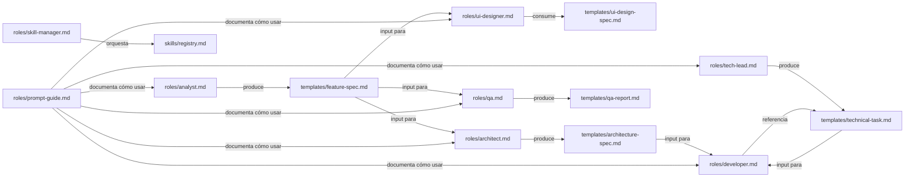

# Estructura del Repositorio

> Referencia completa de la organización de `ai-agents` y el propósito de cada carpeta y archivo.

---

## Árbol completo

```
ai-agents/
│
├── roles/                        # Agentes del sistema (fuente canónica)
│   ├── analyst.md                 # Product Analyst v3.0
│   ├── architect.md               # Software Architect v3.0
│   ├── tech-lead.md               # Tech Lead v3.0
│   ├── developer.md               # Senior Developer v3.0
│   ├── qa.md                      # QA Engineer v3.0
│   ├── devops.md                  # DevOps Engineer v3.0
│   ├── ui-designer.md             # UI Designer v3.0
│   ├── skill-manager.md           # Skill Manager v3.0 (orquestador)
│   ├── prompt-guide.md            # Guía de prompts por agente
│   └── README.md                  # Índice de agentes y pipeline visual
│
├── skills/                        # Framework Skills metodológicas
│   ├── README.md                  # Catálogo de las 15 skills
│   ├── registry.md                # Reglas de orquestación y priorización
│   ├── analysis/                  # requirements-discovery, ux-heuristics
│   ├── architecture/              # api-design, backend-architecture, database-design, performance-tuning, ai-integration
│   ├── development/               # code-review, frontend-patterns, mobile-development
│   ├── qa/                        # test-strategy, testing-automation, security-audit
│   └── workflow/                  # release-readiness, devops-pipeline
│
├── templates/                     # Plantillas de documentos y sistemas
│   ├── ide-configs/               # Configs para IDEs de IA (AGENTS.md, CLAUDE.md, cursorrules…)
│   ├── dag-manifest.yaml          # Template de DAG para workflows
│   ├── knowledge-graph.yaml       # Template del grafo de decisiones
│   ├── metrics-executions.yaml    # Template de métricas por ejecución
│   ├── github-action-ci.yml       # CI multi-lenguaje (documental + Node/Python/Go)
│   ├── feature-spec.md            # Especificación funcional (output del Analyst)
│   ├── ui-design-spec.md          # Diseño visual (output del UI Designer)
│   ├── architecture-spec.md       # Diseño técnico (output del Architect)
│   ├── technical-task.md          # Tarea para el Developer (output del Tech Lead)
│   ├── qa-report.md               # Reporte de QA (output del QA Engineer)
│   ├── bug-report.md              # Reporte de bug (cualquier agente)
│   ├── discovery.md               # Análisis previo a la spec (opcional)
│   ├── feature-folder-template.md # Estructura estándar de carpeta por feature
│   └── project-context.md         # Contexto del proyecto (.ai/context.md)
│
├── checklists/                    # Checklists de revisión por área
│   ├── frontend-review.md         # Revisión de código frontend
│   ├── ui-review.md               # Revisión de UI/UX y accesibilidad
│   ├── backend-review.md          # Revisión de código backend
│   ├── database-review.md         # Revisión de schema y migraciones
│   ├── security-review.md         # Revisión de seguridad
│   ├── performance-review.md      # Revisión de rendimiento
│   └── release-review.md          # Checklist pre-release
│
├── workflows/                     # Flujos de trabajo (con DAG declarado)
│   ├── new-feature.md             # Pipeline completo para nueva feature
│   ├── bug-fix.md                 # Flujo de corrección de bugs
│   ├── refactor.md                # Flujo de refactoring
│   ├── release.md                 # Proceso de release a producción
│   └── architecture-change.md     # Cambios de arquitectura
│
├── scripts/                       # Scripts de automatización
│   ├── setup-ide.sh               # Inicializa .ai/ + seeds v3.2.0 y genera reglas de IDE
│   ├── update-ai-agents.sh        # Actualiza el framework (submodule + setup en un comando)
│   ├── new-initiative.sh          # Bootstrap de feature/bug
│   ├── validate-project.sh        # Valida estructura documental + sistemas v3.2.0
│   └── common.sh                  # Librería compartida (interno)
│
├── docs/                          # Documentación del repositorio
│   ├── agent-definitions.md       # Estándar de diseño de agentes
│   ├── repository-structure.md    # Este archivo
│   ├── agent-lifecycle.md         # Ciclo de vida de un agente
│   ├── versioning-strategy.md     # Estrategia de versionado (agentes + skills)
│   ├── project-integration.md     # Cómo integrar en proyectos
│   ├── project-ai-structure.md    # Estructura .ai/ de proyectos integrados
│   ├── artifact-lifecycle.md      # Ciclo de vida de artefactos (spec→qa)
│   ├── workflow-memory.md         # Sistema de memoria persistente
│   ├── workflow-dag.md            # Sistema de DAG de workflows
│   ├── knowledge-graph.md         # Grafo ligero de decisiones
│   ├── agent-metrics.md           # Métricas por rol y fase
│   ├── skill-discovery.md         # Descubrimiento de skills
│   ├── skill-resolution.md        # Resolución de conflictos (shadowing)
│   ├── skill-context.md           # Contexto y habilidades
│   ├── skill-manager.md           # Rol de orquestación
│   ├── external-skill-providers.md# Proveedores externos de skills
│   ├── sdd-philosophy.md          # Filosofía SDD
│   ├── documentation-strategy.md  # Estrategia documental
│   ├── naming-conventions.md      # Convenciones de nomenclatura
│   └── roadmap.md                 # Hoja de ruta evolutiva
│
├── .gitignore                     # Archivos ignorados por Git
├── AGENTS.md                      # Guía de contribución al repo
├── CHANGELOG.md                   # Historial de versiones
└── README.md                      # Punto de entrada del repositorio
```

---

## Propósito de cada sección

### `roles/` — El núcleo

Contiene las definiciones de los agentes. Es la sección más importante del repositorio. Cada agente define:
- Su rol y experiencia
- Lo que hace y lo que **no** hace
- Cómo razona antes de responder (Chain of Thought)
- El formato exacto de su output
- Cómo activarlo con un prompt

**Regla:** Ningún agente vive fuera de `roles/`. La raíz del repositorio es solo para archivos de configuración del repo.

---

### `templates/` — Contratos de trabajo

Los templates definen la estructura de los documentos que producen los agentes. Son los **contratos** entre agentes:

```
Analyst produce → feature-spec.md (y discovery.md opcional)
UI Designer consume feature-spec.md → produce ui-design-spec.md
Architect consume feature-spec.md → produce architecture-spec.md
Tech Lead consume ambos → produce technical-task.md
Developer consume technical-task.md → produce código
QA consume feature-spec.md + código → produce qa-report.md
```

Además de los templates de documentos, `templates/` contiene las plantillas de los **sistemas** que todo proyecto integrado recibe:
- `dag-manifest.yaml` — DAG de un workflow (balance de bloques)
- `knowledge-graph.yaml` — Grafo de relaciones entre decisiones
- `metrics-executions.yaml` — Registro de métricas por ejecución
- `github-action-ci.yml` — CI multi-lenguaje (validación documental + Node/Python/Go)
- `ide-configs/` — Configuraciones para IDEs de IA

**Regla:** Cada template debe ser completamente independiente del stack tecnológico. Deben ser reutilizables en cualquier proyecto.

---

### `skills/` — Framework Skills

Skills metodológicas (categorías `method`) que los agentes invocan según la tarea: UX, arquitectura backend, testing, seguridad, performance, pipelines, etc. Incluyen el `registry.md` (reglas de orquestación y priorización) y el `README.md` (catálogo).

**Regla:** Una skill describe **cómo resolver** un tipo de problema concreto, no un stack tecnológico específico. Las categorías `type: tech` viven en fuentes externas (skills.sh, MCP servers) vía el sistema de descubrimiento.

---

### `checklists/` — Validación estructurada

Los checklists son herramientas de revisión que garantizan que nada crítico se omite antes de aprobar un PR o hacer un release. Los usa principalmente el **QA Engineer** y el **Tech Lead**.

**Regla:** Los checklists deben ser prácticos y directos. Cada ítem debe ser verificable con un sí/no.

---

### `workflows/` — Procesos reproducibles

Los workflows documentan el flujo completo de trabajo para escenarios comunes. Incluyen diagramas Mermaid, los agentes involucrados, los artefactos que se producen y un **manifest DAG** declarado (bloques `on:`/`steps:` balanceados) que habilita la ejecución programática y la validación en CI.

**Regla:** Un workflow debe poder seguirse sin conocimiento previo del repositorio. Debe ser autocontenido.

**Referencia:** Sistema de DAG en [`workflow-dag.md`](workflow-dag.md).

---

### `scripts/` — Automatización

Scripts de setup y validación que los proyectos consumen desde `.ai/agents/scripts/`: `setup-ide.sh` (inicializa `.ai/` y reglas de IDE, con modo `--auto` para no-interactivo), `update-ai-agents.sh` (actualiza el framework en un comando: submodule + setup), `new-initiative.sh` (bootstrap de feature/bug/auditoría/refactor), `finish-phase.sh` (cierre de fase: registra entrada en `workflow-log.md`, ejecución en `executions.yaml` y regenera `context-snapshot.md` — garantiza que los sistemas v3.2.0 tengan datos), `validate-project.sh` (cumplimiento de reglas documentales) y `common.sh` (librería compartida).

**Regla:** Los scripts deben ser idempotentes y no destructivos: pueden ejecutarse varias veces sin romper el estado del proyecto.

---

### `docs/` — Conocimiento del repositorio

Documentación sobre el repositorio en sí — cómo funciona, cómo evoluciona, cómo integrarlo. Incluye la documentación de los **sistemas** del framework: memoria persistente (`workflow-memory.md`), DAG (`workflow-dag.md`), grafo de decisiones (`knowledge-graph.md`), métricas (`agent-metrics.md`) y orquestación de skills (`skill-discovery.md`, `skill-resolution.md`, `skill-context.md`, `external-skill-providers.md`).

**Regla:** La documentación de `docs/` es sobre `ai-agents` como sistema. La documentación de proyectos específicos va en `.ai/context.md` dentro de cada proyecto.

---

## Convenciones de nomenclatura

| Tipo | Formato | Ejemplo |
|------|---------|---------|
| Archivos | `kebab-case.md` | `feature-spec.md` |
| Carpetas | `kebab-case/` | `backend-architecture/` |
| IDs de features | `FEAT-XXX` | `FEAT-015` |
| IDs de bugs | `BUG-XXX` | `BUG-003` |
| IDs de QA reports | `QA-XXX` | `QA-008` |
| IDs de tasks | `TASK-XXX` | `TASK-021` |
| Versiones de agentes | `X.Y` | `3.0` |
| Versiones de skills | `MAJOR.MINOR` | `1.0` |
| Tags de Git | `vX.Y.Z` | `v3.2.0` |

---

## Relación entre archivos



---

*Documentación versión 3.0 — ai-agents library | [github.com/ezequielmendoza-dev/ai-agents](https://github.com/ezequielmendoza-dev/ai-agents)*
