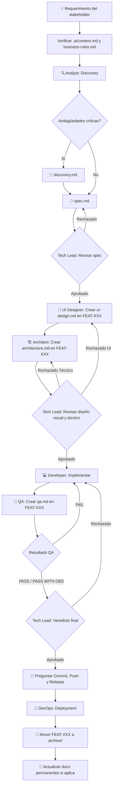

# Workflow: Nueva Feature

> **Versión:** 2.0  
> **Agentes involucrados:** Analyst → UI Designer → Architect → Tech Lead → Developer → QA → DevOps (si aplica)

---

## Cuándo usar este workflow

- Se solicita implementar una funcionalidad nueva
- La feature no existe en ninguna forma en el sistema
- Hay un requerimiento del stakeholder que necesita especificarse y construirse

---

## Flujo



---

<!-- dag:start -->
**Modos de ejecución:** `rápido` | `estándar` | `profundo` (ver `docs/workflow-dag.md`)

```yaml
name: new-feature
modes:
  rapido:
    truncate: [discovery, ui-design, architecture]
    note: Para bugs bien definidos o cambios de bajo riesgo en features existentes
  estandar: {}
  profundo:
    extra: [adversarial-review]
    note: Para features críticas o arquitectónicas
nodes:
  discovery:
    agent: analyst
    input: [context.md, feature-request]
    output: [discovery.md]
    parallel: false
  spec:
    agent: analyst
    input: [context.md, discovery.md (opcional)]
    output: [spec.md]
    parallel: false
  tech-review-1:
    agent: tech-lead
    input: [spec.md]
    output: [verdict]
    gate: true
  ui-design:
    agent: ui-designer
    input: [spec.md, context.md]
    output: [ui-design.md]
    parallel: false
  architecture:
    agent: architect
    input: [spec.md, ui-design.md, context.md, architecture.md]
    output: [architecture.md]
    parallel: false
  tech-review-2:
    agent: tech-lead
    input: [spec.md, ui-design.md, architecture.md]
    output: [verdict]
    gate: true
  implement:
    agent: developer
    input: [task.md, spec.md, ui-design.md, architecture.md]
    parallel: true
  qa:
    agent: qa
    input: [spec.md, ui-design.md, architecture.md, code]
    output: [qa.md]
    parallel: false
  tech-review-3:
    agent: tech-lead
    input: [qa.md]
    output: [verdict]
    gate: true
  deploy:
    agent: devops
    input: [architecture.md]
    output: [release]
    parallel: false
  adversarial-review:
    agent: qa
    input: [spec.md, architecture.md, code]
    output: [adversarial-review.md]
    parallel: false
edges:
  - { from: discovery,      to: spec }
  - { from: spec,           to: tech-review-1 }
  - { from: tech-review-1,  to: ui-design,     on: APROBADO }
  - { from: tech-review-1,  to: spec,          on: RECHAZADO, retry: 1, back: true }
  - { from: ui-design,      to: architecture }
  - { from: architecture,   to: tech-review-2 }
  - { from: tech-review-2,  to: implement,     on: APROBADO }
  - { from: tech-review-2,  to: ui-design,     on: RECHAZADO_UI,       retry: 1, back: true }
  - { from: tech-review-2,  to: architecture,  on: RECHAZADO_TECNICO,  retry: 1, back: true }
  - { from: implement,      to: qa }
  - { from: qa,             to: tech-review-3 }
  - { from: qa,             to: implement,     on: FAIL, retry: 1, back: true }
  - { from: tech-review-3,  to: deploy,        on: PASS }
  - { from: tech-review-3,  to: implement,     on: FAIL, retry: 1, back: true }
  - { from: tech-review-3,  to: adversarial-review, type: fan-out }   # solo en modo profundo
  - { from: adversarial-review, to: deploy,    on: PASS, type: fan-in }
hotfix:
  enabled: false
```
<!-- dag:end -->

---

## Pasos Detallados

### Paso 0 — Preparación

Antes de iniciar cualquier trabajo:

1. Leer `.ai/context.md` para entender el sistema actual
2. Leer `.ai/business-rules.md` para conocer las restricciones de negocio
3. Leer `.ai/architecture.md` para entender la arquitectura vigente
4. Consultar `.ai/decisions.md` para conocer decisiones relevantes anteriores
5. **Asignar el ID de la feature** consultando el Registro de IDs en `context.md`
6. Crear la carpeta `.ai/features/FEAT-NNN-slug/`

```bash
mkdir -p .ai/features/FEAT-NNN-slug
touch .ai/features/FEAT-NNN-slug/discovery.md # Opcional, solo si hay ambigüedades
touch .ai/features/FEAT-NNN-slug/spec.md
touch .ai/features/FEAT-NNN-slug/ui-design.md
touch .ai/features/FEAT-NNN-slug/architecture.md
touch .ai/features/FEAT-NNN-slug/qa.md
touch .ai/features/FEAT-NNN-slug/decision.md
```

7. Actualizar el Registro de IDs en `.ai/context.md`

---

### Paso 0.5 — Discovery (Analyst - Opcional)

**Agente:** Product Analyst  
**Output:** `.ai/features/FEAT-NNN-slug/discovery.md`  
**Template:** [`templates/discovery.md`](../templates/discovery.md)

**Activación:** Ocurre automáticamente en la evaluación del Analyst. Si detecta ambigüedades críticas, interrumpe el flujo normal y produce este documento en lugar de la spec.

**Criterio de salida:** `discovery.md` publicado. Se requiere respuesta del stakeholder para continuar.

---

### Paso 1 — Especificación Funcional (Analyst)

**Agente:** Product Analyst  
**Output:** `.ai/features/FEAT-NNN-slug/spec.md`  
**Template:** [`templates/feature-spec.md`](../templates/feature-spec.md)

**Activación:**

```
Actúa como el agente Product Analyst definido en roles/analyst.md.

Contexto del proyecto: [contenido de .ai/context.md]
Reglas de negocio: [contenido de .ai/business-rules.md]

Feature a especificar: FEAT-NNN — [nombre]

Requerimiento:
[descripción del requerimiento]
```

**Criterio de salida:** `spec.md` completa, sin preguntas abiertas bloqueantes, lista para revisión del Tech Lead.
- **Cierre Obligatorio (R6):**
  ```bash
  bash .ai/agents/scripts/finish-phase.sh FEAT-NNN-slug analysis analyst \
    --model <MODELO> --tokens-in <IN> --tokens-out <OUT> --duration <S> --source measured
  ```

---

### Paso 2 — Revisión de Especificación (Tech Lead)

**Agente:** Tech Lead  
**Veredictos posibles:** APROBADO / APROBADO CON OBSERVACIONES / RECHAZADO

Si es **RECHAZADO** → volver al Paso 1 con el feedback del Tech Lead.  
Si es **APROBADO** → continuar al Paso 3.

**Activación:**

```
Actúa como el agente Tech Lead definido en roles/tech-lead.md.

Contexto del proyecto: [contenido de .ai/context.md]

Estoy presentando para revisión: feature-spec en .ai/features/FEAT-NNN-slug/spec.md
```

- **Cierre Obligatorio (R6):**
  ```bash
  bash .ai/agents/scripts/finish-phase.sh FEAT-NNN-slug tech-review-1 tech-lead --verdict <APROBADO|RECHAZADO> \
    --model <MODELO> --tokens-in <IN> --tokens-out <OUT> --duration <S> --source measured
  ```

---

### Paso 3 — Diseño de Interfaz (UI Designer)

**Agente:** UI Designer  
**Output:** `.ai/features/FEAT-NNN-slug/ui-design.md`  
**Template:** [`templates/ui-design-spec.md`](../templates/ui-design-spec.md)

**Activación:**

```
Actúa como el agente UI Designer definido en roles/ui-designer.md.

Contexto del proyecto: [contenido de .ai/context.md]

Especificación funcional de referencia:
[contenido de .ai/features/FEAT-NNN-slug/spec.md]
```

**Criterio de salida:** `ui-design.md` completa, con la arquitectura de información, layouts y componentes diseñados para todos los viewports, lista para el desarrollo.
- **Cierre Obligatorio (R6):**
  ```bash
  bash .ai/agents/scripts/finish-phase.sh FEAT-NNN-slug ui-design ui-designer \
    --model <MODELO> --tokens-in <IN> --tokens-out <OUT> --duration <S> --source measured
  ```

---

### Paso 4 — Diseño Técnico (Architect)

**Agente:** Software Architect  
**Output:** `.ai/features/FEAT-NNN-slug/architecture.md`  
**Template:** [`templates/architecture-spec.md`](../templates/architecture-spec.md)

Si el diseño requiere cambios en la arquitectura global, actualizar `.ai/architecture.md` y `.ai/knowledge-graph.yaml` en este paso.

**Activación:**

```
Actúa como el agente Software Architect definido en roles/architect.md.

Contexto del proyecto: [contenido de .ai/context.md]
Arquitectura actual: [contenido de .ai/architecture.md]

Especificación funcional a diseñar:
[contenido de .ai/features/FEAT-NNN-slug/spec.md]

Diseño visual de referencia:
[contenido de .ai/features/FEAT-NNN-slug/ui-design.md]
```

- **Cierre Obligatorio (R6):**
  ```bash
  bash .ai/agents/scripts/finish-phase.sh FEAT-NNN-slug architecture architect \
    --model <MODELO> --tokens-in <IN> --tokens-out <OUT> --duration <S> --source measured
  ```

---

### Paso 5 — Revisión de Diseño (Tech Lead)

**Agente:** Tech Lead  
**Veredictos posibles:** APROBADO / APROBADO CON OBSERVACIONES / RECHAZADO

Si es **RECHAZADO** (por diseño técnico o visual) → volver al Paso 3 o 4 con el feedback del Tech Lead.  
Si hay decisiones de arquitectura importantes → registrar en `.ai/decisions.md` y `.ai/knowledge-graph.yaml`.  
Si es **APROBADO** → continuar al Paso 6.

- **Cierre Obligatorio (R6):**
  ```bash
  bash .ai/agents/scripts/finish-phase.sh FEAT-NNN-slug tech-review-2 tech-lead --verdict <APROBADO|RECHAZADO> \
    --model <MODELO> --tokens-in <IN> --tokens-out <OUT> --duration <S> --source measured
  ```

---

### Paso 6 — Implementación (Developer)

**Agente:** Senior Developer  
**Template de referencia:** [`templates/technical-task.md`](../templates/technical-task.md)

#### 🎯 Sub-paso 6.1: Localización Previa (Token Optimization)
Antes de escribir código o editar archivos, el Developer debe:
1. **Localizar:** Listar explícitamente qué archivos, funciones o clases existentes serán modificadas y cuáles se crearán.
2. **Delimitar:** Confirmar que no se tocarán componentes fuera del alcance del `spec.md` y `architecture.md`.
3. **Living Task List:** Iniciar una lista de tareas vivas con checkboxes `- [ ]` en `technical-task.md` para rastrear el avance incremental.

**Activación:**

```
Actúa como el agente Senior Developer definido en roles/developer.md.

Contexto del proyecto: [contenido de .ai/context.md]

Tarea a implementar:
[descripción de la tarea técnica]

Especificación de referencia:
[contenido de .ai/features/FEAT-NNN-slug/spec.md]

Diseño visual de referencia:
[contenido de .ai/features/FEAT-NNN-slug/ui-design.md]

Diseño técnico de referencia:
[contenido de .ai/features/FEAT-NNN-slug/architecture.md]
```

**Criterio de salida:** Implementación completa, funcional, con tests unitarios pasando y fiel a la UI y la arquitectura, lista para QA.
- **Cierre Obligatorio (R6):**
  ```bash
  bash .ai/agents/scripts/finish-phase.sh FEAT-NNN-slug implement developer \
    --model <MODELO> --tokens-in <IN> --tokens-out <OUT> --duration <S> --source measured
  ```

---

### Paso 7 — Validación de Calidad (QA) y Self-Healing Loop

**Agente:** QA Engineer  
**Output:** `.ai/features/FEAT-NNN-slug/qa.md`  
**Template:** [`templates/qa-report.md`](../templates/qa-report.md)

**Activación:**

```
Actúa como el agente QA Engineer definido en roles/qa.md.

Contexto del proyecto: [contenido de .ai/context.md]

Feature spec de referencia:
[contenido de .ai/features/FEAT-NNN-slug/spec.md]

Diseño visual de referencia:
[contenido de .ai/features/FEAT-NNN-slug/ui-design.md]

Diseño técnico de referencia:
[contenido de .ai/features/FEAT-NNN-slug/architecture.md]

Implementación a revisar:
[descripción de los cambios implementados]
```

#### 🔄 Protocolo de Autocorrección (Self-Healing Loop)
Si el resultado es **RECHAZADO / FAIL**:
1. El QA genera en `qa.md` un diagnóstico estructurado con:
   - Archivo y línea causante del fallo.
   - Trace o log de error exacto.
   - Criterio de aceptación o test roto.
2. **Developer Parchea:** El Developer consume `qa.md`, aplica el parche correctivo y re-ejecuta la suite de pruebas.
3. **Re-evaluación:** Se repite el paso de QA (máximo 3 iteraciones). Si tras 3 intentos no pasa, se escala al Tech Lead para intervención arquitectónica.
4. Si el resultado es **APROBADO / PASS** → continuar al Paso 8.
- **Cierre Obligatorio (R6):**
  ```bash
  bash .ai/agents/scripts/finish-phase.sh FEAT-NNN-slug qa qa --verdict <APROBADO|RECHAZADO> \
    --model <MODELO> --tokens-in <IN> --tokens-out <OUT> --duration <S> --source measured
  ```

---

### Paso 8 — Final Veredicto (Tech Lead)

**Agente:** Tech Lead  
**Acción:** Revisar el reporte de QA y emitir veredicto final de deployment.

**Interacción Interactiva (Commit, Push y Release):**
> [!IMPORTANT]
> Una vez que el Tech Lead apruebe la feature, la IA **debe guiar activamente al usuario** en:
> 1. **Commit y Push:** Proponer un mensaje de commit que siga rigorousamente las convenciones (ej. `feat(scope): FEAT-NNN - descripcion`). Preguntar al usuario si desea proceder.
> 2. **Version Bump:** Una vez hecho el commit, ejecutar `npm run bump:minor -- "FEAT-NNN: descripción"` para actualizar la versión (minor), el CHANGELOG y el context. Esto mueve los cambios de `[Unreleased]` a la nueva versión.
> 3. **Git Tag:** Crear tag `git tag -a vX.Y.Z -m "FEAT-NNN: descripción"` y push con `git push --tags`.
> 4. **Release:** Indicar al usuario si debe proceder con release según [`workflows/release.md`](release.md).
> 5. **Cierre Obligatorio (R6):**
>    ```bash
>    bash .ai/agents/scripts/finish-phase.sh FEAT-NNN-slug approval tech-lead --verdict APROBADO \
>      --model <MODELO> --tokens-in <IN> --tokens-out <OUT> --duration <S> --source measured [--archive]
>    ```

---

### Paso 9 — Deployment (DevOps)

**Agente:** DevOps Engineer (bajo demanda del Tech Lead)  
**Workflow:** Ver [`workflows/release.md`](release.md) para el proceso de deployment.
- **Cierre Obligatorio (R6):**
  ```bash
  bash .ai/agents/scripts/finish-phase.sh FEAT-NNN-slug deploy devops --verdict PASS --archive \
    --model <MODELO> --tokens-in <IN> --tokens-out <OUT> --duration <S> --source measured
  ```

---

### Paso 10 — Cierre y Archivado de Feature

Cuando la feature está validada por QA y lista para producción:

1. **Validación en Entorno de Pruebas (Staging):**  
   El Tech Lead presenta el resultado al usuario para que realice pruebas funcionales si lo desea.
2. **Archivado Automático al Pasar a Producción:**  
   Al confirmar el pase a producción, se ejecuta el archivado seguro:
   ```bash
   bash .ai/agents/scripts/archive-initiative.sh FEAT-NNN-slug
   # o en un solo paso durante el cierre de fase:
   bash .ai/agents/scripts/finish-phase.sh FEAT-NNN-slug approval tech-lead --verdict APROBADO --archive \
     --model <MODELO> --tokens-in <IN> --tokens-out <OUT> --duration <S> --source measured
   ```
   *Esto valida QA, mueve la carpeta a `.ai/archive/`, actualiza `knowledge-graph.yaml`, registra en `workflow-log.md` y regenera `context-snapshot.md`.*

3. **Actualizar documentos permanentes si aplica:**
   - `.ai/architecture.md` si cambió la arquitectura del sistema
   - `.ai/business-rules.md` si se incorporaron nuevas reglas permanentes
   - `.ai/glossary.md` si aparecieron nuevos términos del dominio
   - `.ai/decisions.md` si hay decisiones que aplican globalmente

4. **Actualizar** el `CHANGELOG.md` del proyecto con la feature completada.

---

## Checklist de Cierre de Feature

- [ ] `spec.md` en estado `Aprobada`
- [ ] `ui-design.md` en estado `Aprobado`
- [ ] `architecture.md` en estado `Aprobado`
- [ ] `qa.md` en estado `PASS` / `APROBADO`
- [ ] Veredicto del Tech Lead: `APROBADO`
- [ ] Usuario validó en entorno de pruebas / staging
- [ ] Código en rama principal / producción
- [ ] Documentos permanentes actualizados si fue necesario
- [ ] Feature archivada automáticamente a `.ai/archive/` (`archive-initiative.sh`)
- [ ] `CHANGELOG.md` actualizado
- [ ] Versión bumpeda (`npm run bump:minor`)
- [ ] Git tag `vX.Y.Z` creado y pusheado

---

*Workflow Nueva Feature v3.4.0 — ai-agents framework | github.com/ezequielmendoza-dev/ai-agents*
